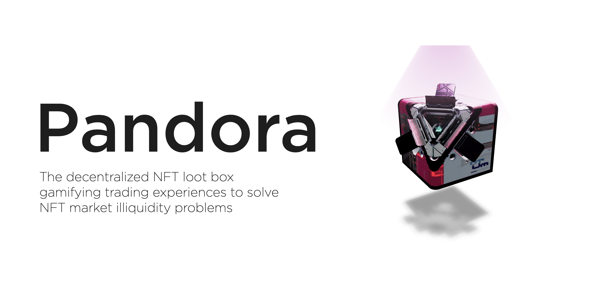
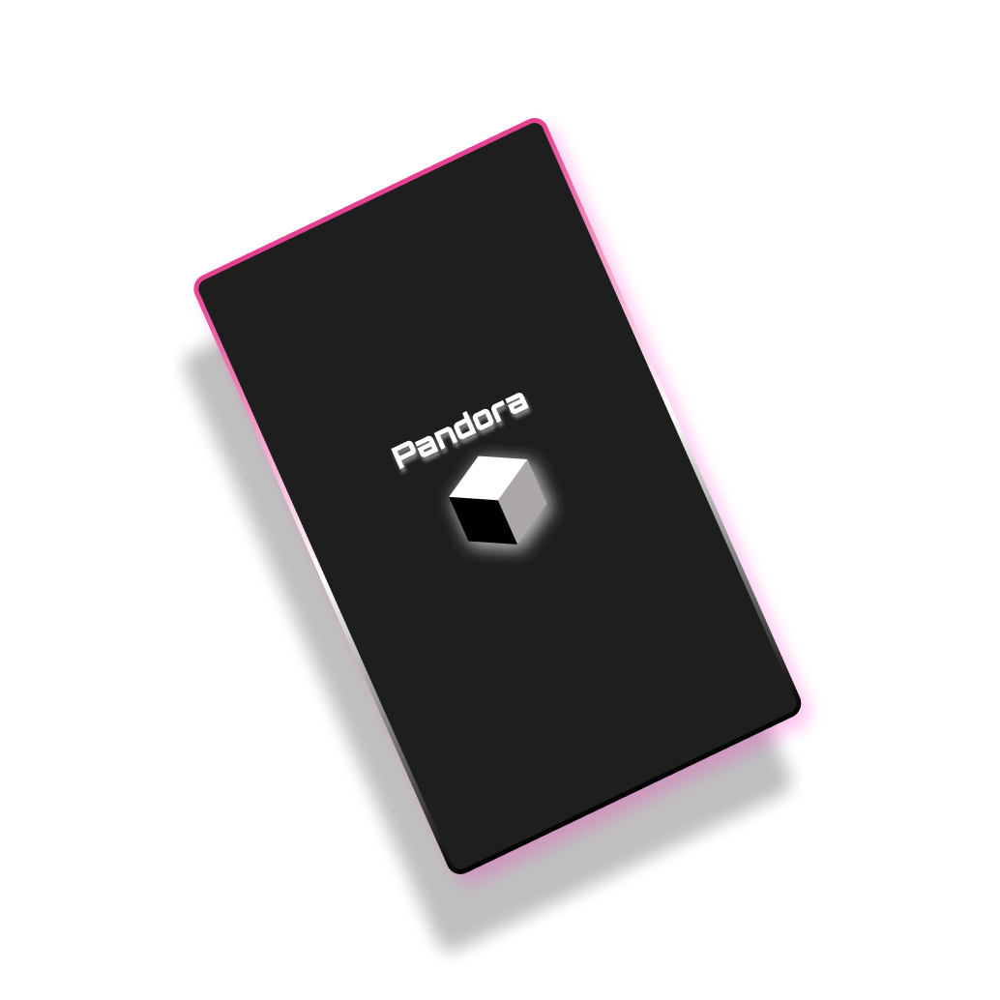
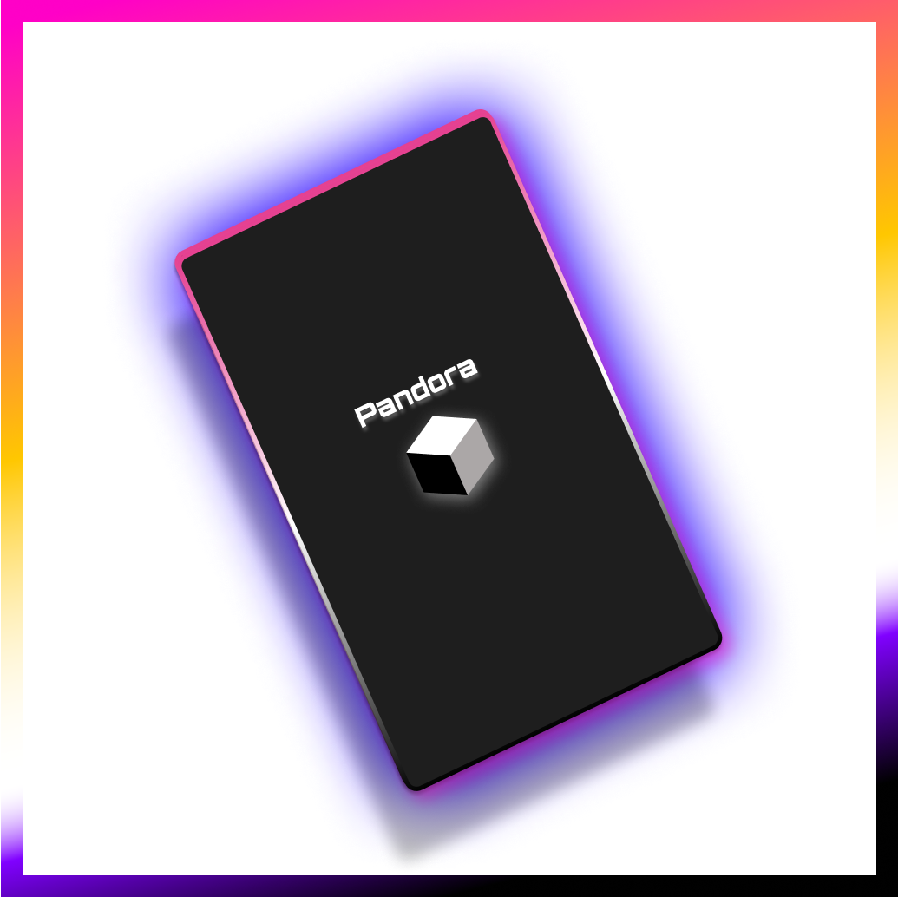
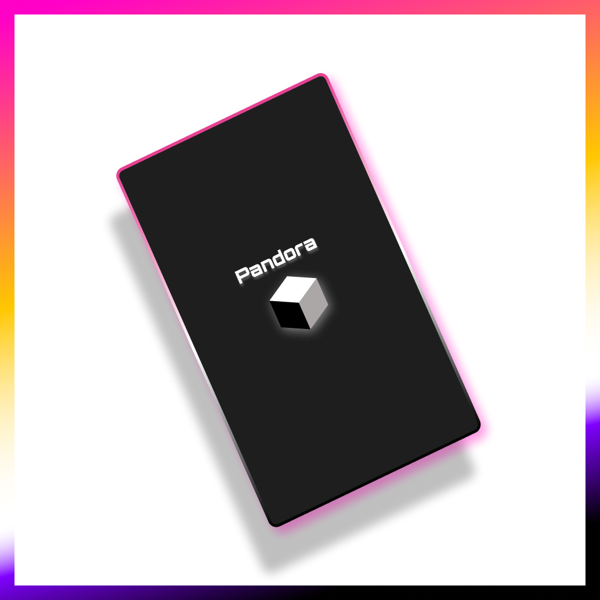
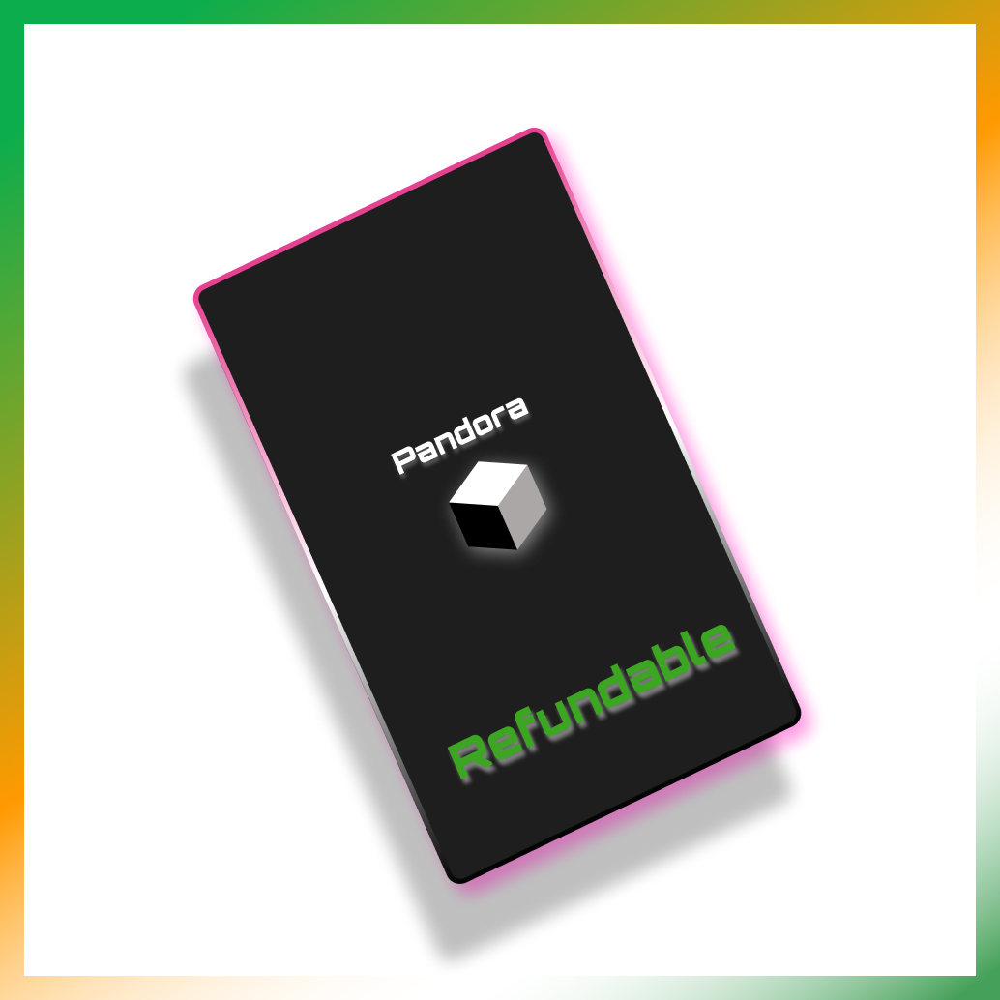
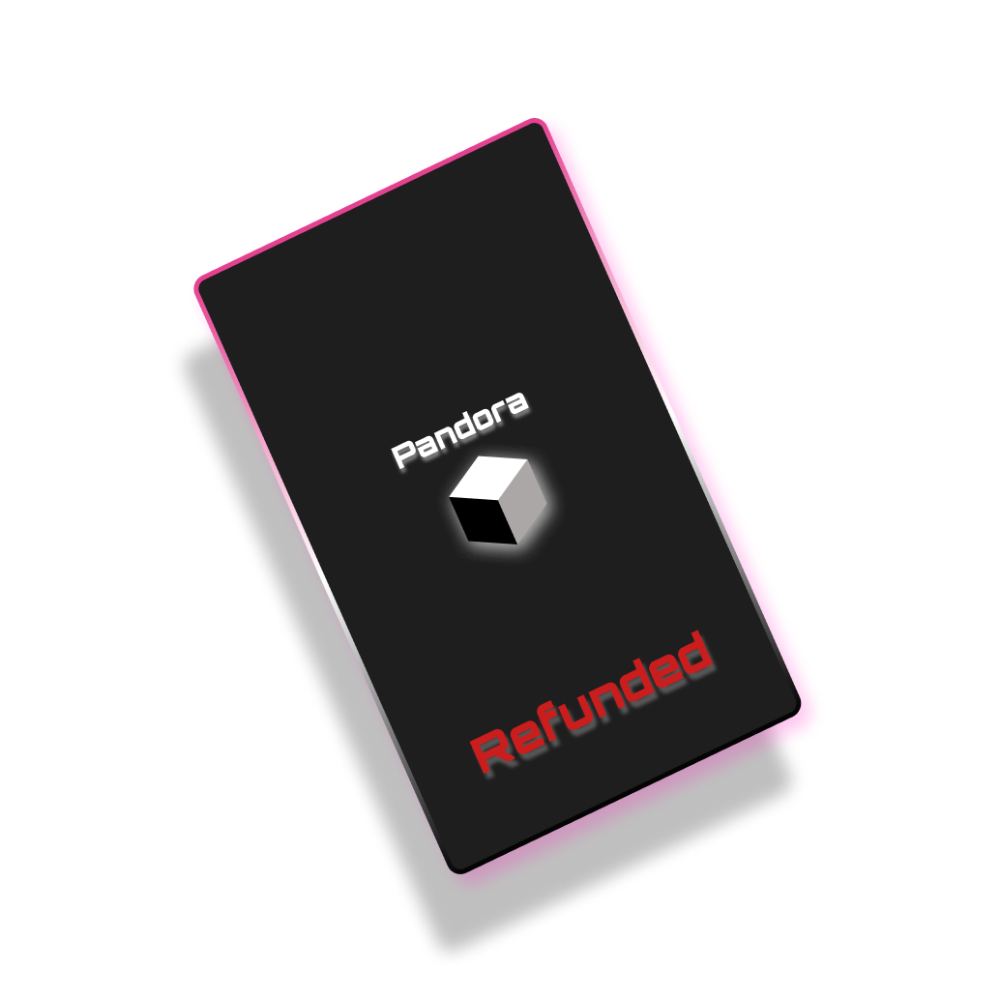
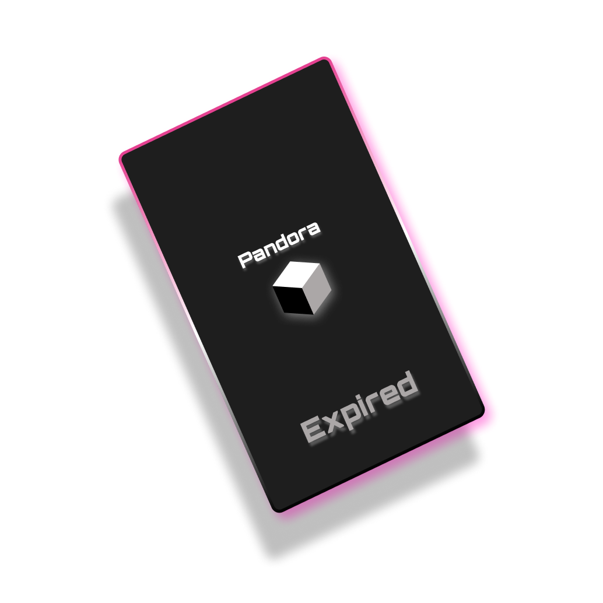
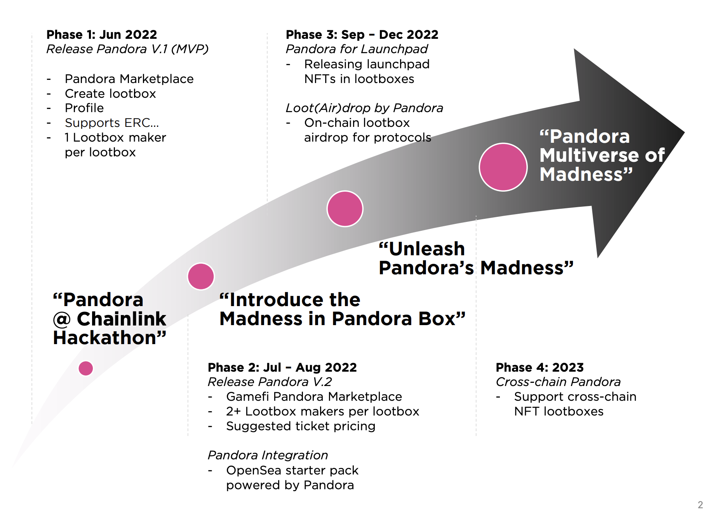

# Pandora - The NFT Lootbox

👀 Visit us here: https://pandora.on.fleek.co

📱 Available on

- Binance Smart Chain (Testnet)
- Polygon (Testnet)
- Avalanche (Testnet)

📈 Subgraph:

- https://thegraph.com/hosted-service/subgraph/pannavich/pandora-nft-chapel
- https://thegraph.com/hosted-service/subgraph/pannavich/pandora-nft-mumbai
- https://thegraph.com/hosted-service/subgraph/pannavich/pandora-nft-fuji

# Table of Content

- [TL; DR](#tl-dr)
- [The Why](#the-why)
- [The Pandora Tickets](#the-pandora-tickets)
  - [The Normal Ticket](#the-normal-ticket)
  - [The Winning Ticket](#the-winning-ticket)
  - [The Claimed Ticket](#the-claimed-ticket)
  - [The Refundable Ticket](#the-refundable-ticket)
  - [The Refunded Ticket](#the-refunded-ticket)
  - [The Expired Ticket](#the-expired-ticket)
- [How it works?](#how-it-works)
  - [Sell](#sell)
  - [Buy](#buy)
  - [Exercise](#exercise)
  - [Redeem](#redeem)
- [What's next for Pandora](#whats-next-for-pandora)

# TL; DR

- Pandora is a decentralized NFT lootbox/gacha/mysterybox.
- It aims to gamify NFT buy-and-sell experiences to solve the NFT market's illiquidity problems.
- Pandora’s NFT lootbox concept is similar to lootbox in general mass games (e.g., Overwatch, CS:GO)
- The “Lootbox maker”, who holds many NFTs, can deposit their NFTs in the lootbox and set the ticket’s price.
- “Ticket buyer” can purchase the tickets to get the random NFTs inside the lootbox.
- Pandora will mint tickets for Ticket Buyer and random drawing mechanisms using Chainlink VRF and Keepers.

# The Why

There is nothing fancy about the “Big why” that Pandora is trying to address. NFT
illiquidity has been the elephant in the room since its inception. Many have been
trying to offer solutions - NFT lending, NFT installment, and tokenized NFT to name
a few. Although we respect those ideas with the same intention and such creative
solutions, we feel that they, sometimes, can be too complicated and not userfriendly. Pandora believes otherwise. NFT illiquidity should be address with “fun”;
with gamifying experience.

# The Pandora Tickets

There are 6 types of Pandora Ticket NFT.

- ### The Normal Ticket

    

- ### The Winning Ticket

    

- ### The Claimed Ticket

    

- ### The Refundable Ticket

    

- ### The Refunded Ticket

    

- ### The Expired Ticket

    

# How it works?

To understand how Pandora works, there are two main actors in Pandora’s journey: the “Lootbox maker” and the “Ticket buyer”. The two actors will be illustrated through a 3+1-step Pandora journey for ease of understanding (sell, buy, and exercise + redeem).

## Sell

Loot box maker picks his NFTs that he wants to sell. He can choose to create a loot box by choosing the name, setting the ticket price, minimum ticket required, and the expiration period then he can select those NFTs. The loot box will be put up on Pandora’s marketplace page.

## Buy

Ticket buyer browses through the marketplace to choose which loot box he wants to buy a ticket from. After purchase, he will get a ticket NFT to use to redeem the prize. He can also sell this ticket NFT on the other NFT marketplace

## Exercise

When the expiration date has come, if the overall minimum tickets purchased are met, the prize redeemable process will proceed meaning the NFTs will be transferred to ticket holders and the lootbox maker gets the total ticket sales. Meanwhile, the ticket buyers will randomly get the NFT from the loot box and claim the NFT through the loot box page

## Redeem

In contrast, if the overall minimum tickets purchased are not met, the loot box maker can claim back his NFTs in the loot box. This should prevent his concerns about the ownership of the NFTs.
The ticket in the ticket buyer's hands will change from the normal ticket to a ‘Refundable ticket’. He can refund back the purchase amount from Pandora. This should make it fair for the game of luck

# What's next for Pandora

